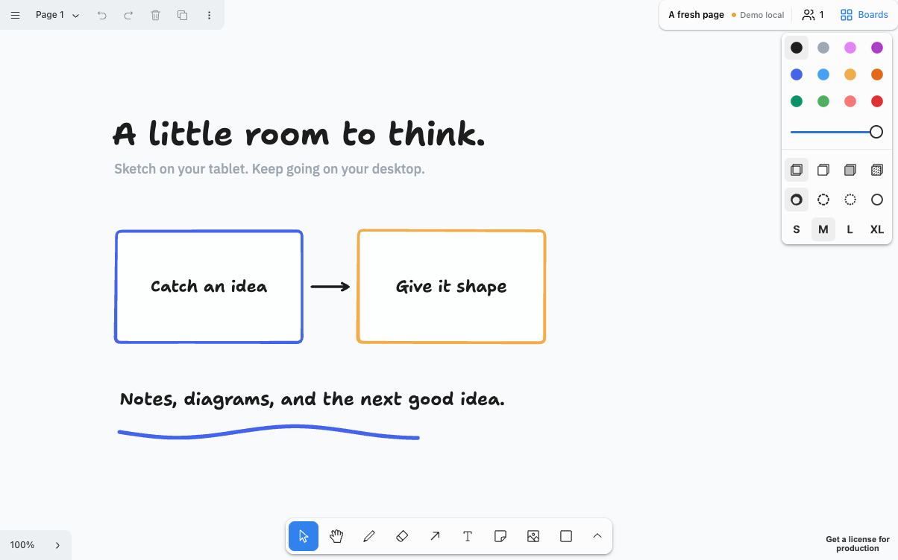
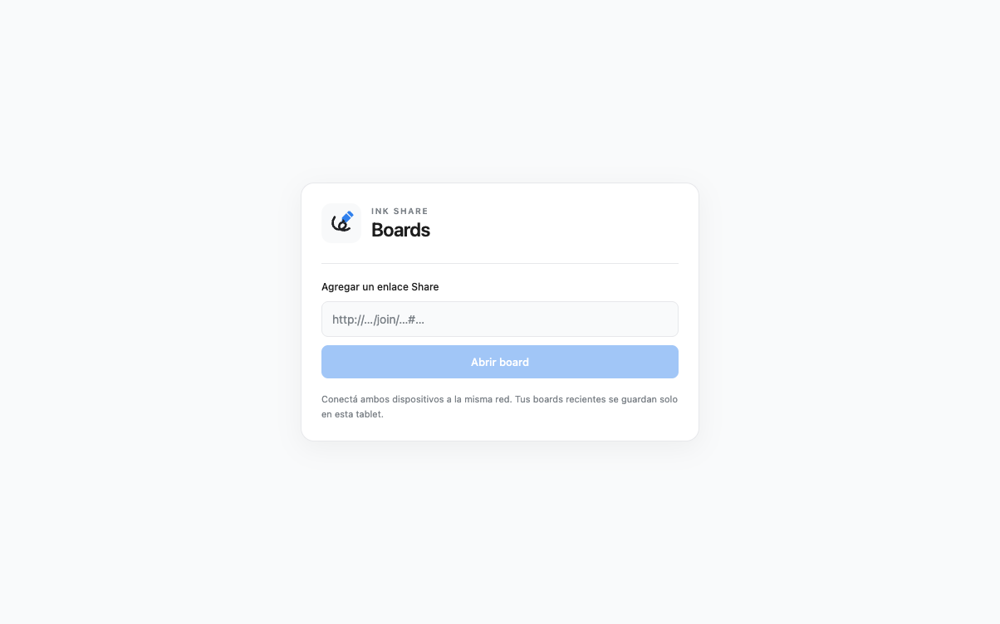
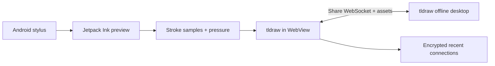

<div align="center">
  
  <h1>Ink Share</h1>
  <p>An Android pen companion for tldraw offline.</p>
  <p>Write on your tablet. Keep your desktop canvas in sync.</p>
  <p><a href="#getting-started">Getting started</a> · <a href="#development">Build it</a> · <a href="docs/RELEASING.md">Releases</a></p>
</div>



*A development screenshot with sample content. The design sandbox is local and does not connect to a shared board.*

Ink Share combines a packaged tldraw editor with Android's native Jetpack Ink preview. It connects directly to an existing **tldraw offline Share** session over your local network: no additional sync server to set up.

This is an independent companion project, not an official tldraw product. It is not a client for arbitrary tldraw.com links.

## What it does

- **Pressure-aware pen preview.** Native Ink rendering follows stylus pressure while you write; completed strokes become editable tldraw `draw` shapes.
- **Smoother handoff.** Additional samples help reduce the change in small letters and curves when the native preview becomes the final stroke.
- **One canvas toolbar.** Board title, connection state, participants, and Boards sit inside tldraw's top controls. Neutral surfaces and blue accents follow the editor's light and dark themes.
- **Easy reconnection.** Up to 12 recent Share connections are stored on the tablet, encrypted using Android Keystore. Open a recent board or remove a saved invitation.
- **Live collaboration.** Shapes and assets sync with the desktop. The participants menu shows presence in the current board and lets you follow a collaborator's view.
- **More drawing space.** Immersive mode hides Android's system bars. Edge gestures can reveal them temporarily.

<details>
<summary>See the Boards screen</summary>



</details>

## Downloads and release status

**Version 0.3.0 is currently a development build. A public production APK is pending a tldraw SDK license.**

The source and build instructions are available here. Production builds require a valid license for this app; the desktop application's license is not reused. The release procedure builds a signed APK with a checksum, ready to attach to [GitHub Releases](https://github.com/facundoPri/tldraw-ink-android/releases). See [release instructions](docs/RELEASING.md).

The [tldraw license documentation](https://tldraw.dev/community/license) describes trial, commercial, and discretionary non-commercial hobby licenses. The SDK keeps its own license regardless of this repository's source license.

## Getting started

Requirements: Android 10 or later, a compatible stylus for native pen input, and a desktop running tldraw offline with Share enabled. Both devices must be able to reach one another on the same network.

1. Open the board on your desktop and enable **Share**.
2. Copy the entire Share invitation, including the fragment after `#`.
3. Open **Ink Share** on Android. Paste the invitation and tap **Abrir board**.
4. Choose the draw tool and start writing. Selection, shapes, and navigation use tldraw's controls.
5. Use **Boards** to switch connections, and the people icon to see participants in the current board.

The custom connection interface currently uses Spanish. The S Pen button routes eraser input while the draw tool is active.

**Keep the app open while reconnecting.** Pending edits are retained during an in-process network interruption; they do not yet survive a force-stop, process death, or reboot.

## Development

Install Node.js 22 LTS or later, npm, JDK 21, and Android SDK platform 37 with build tools. Set `JAVA_HOME` and `ANDROID_HOME` if they are not already configured. The build script also recognizes standard macOS and Linux Android SDK locations.

```sh
git clone https://github.com/facundoPri/tldraw-ink-android.git
cd tldraw-ink-android
npm ci --prefix web
./scripts/build.sh
adb install -r android/app/build/outputs/apk/debug/app-debug.apk
adb shell am start -n com.facundopri.tldrawink/.MainActivity
```

Set `ANDROID_SERIAL` when more than one device is connected. The debug frontend uses tldraw's documented development mode and is intended for development testing. Release builds use production mode and separate signing credentials.

The package identifier remains `com.facundopri.tldrawink`; the launcher name is Ink Share. Debug and release signatures differ: preserve access to your invitations before switching installations. Do not discard your release signing key, as updates must use the same key.

### UI sandbox

```sh
npm --prefix web run dev -- --port 5179
```

Open `http://127.0.0.1:5179/demo.html` for a fresh sample canvas. This is an in-memory design sandbox, excluded from the packaged app. It does not emulate native Android Ink or synchronization.

```sh
npm --prefix web exec -- playwright install chromium
node scripts/verify-design.mjs
```

Alternatively set `BROWSER_CHANNEL=chrome` to use an installed Chrome. Screenshots in `docs/images` contain only the sandbox's sample content; private device evidence belongs in the ignored `artifacts/` folder.

### Device and synchronization tests

See [testing instructions](docs/TESTING.md) for native pressure, small-curve handoff, two-way synchronization, reconnection, and asset probes. Mutation tests require an explicitly selected disposable board.

## How it works



The APK bundles the editor and its UI assets. A `WebViewAssetLoader` serves them from `https://appassets.androidplatform.net`. The native layer captures stylus input, previews it with Jetpack Ink, then passes points to the web editor. After the completed tldraw shape is rendered, the preview is removed.

The editor uses the desktop's existing Share metadata, WebSocket, and asset endpoints. Recent invitations use AES-GCM with an Android Keystore key; the history bridge is restricted to the packaged page's main frame. Android backup is disabled. WebView debugging is enabled only in debug builds.

## Compatibility and limits

| Area | Current status |
| --- | --- |
| Desktop | Validated against tldraw offline 1.18.0; other versions may need schema changes |
| Editor packages | Pinned to `5.5.0-next.3638e0810803` to match the tested host |
| Hardware | Native input checked on Samsung SM-X730, Android 16 |
| Pen handoff | Approximate match; the two renderers can still differ on curves, endpoints, and pressure changes |
| Recent boards | Saved invitations on this tablet; no discovery of all desktop tabs |
| Participants | Presence in the connected board; not all users on the network |
| Offline edits | In-process reconnect supported; durable offline queue pending |
| Custom types | Boards declaring scripted shape types are rejected; scripts are not executed |
| Media | PNG synchronization tested; large files, video, and Android picker flows need further validation |
| Orientation | Landscape checked on hardware; portrait and additional device sizes need broader device testing |

The Share invitation grants board access. Treat it as a credential. The client follows the host's HTTP/WS or HTTPS/WSS protocol; it does not add transport encryption to a plain HTTP LAN Share session. Don't commit real invitations, personal board screenshots, or keystores.

## Project layout

```text
android/          Native WebView host, Ink input, secure history, device tests
web/              React/tldraw editor and development design sandbox
scripts/          Builds and explicit-target verification tools
docs/             Release and testing guides, sample screenshots
```

## License and credits

Original application code and artwork in this repository are available under the [MIT License](LICENSE). Third-party dependencies retain their own terms; see [THIRD_PARTY_NOTICES.md](THIRD_PARTY_NOTICES.md). In particular, the tldraw SDK is source-available and requires its own license for production use.

Built with [tldraw](https://tldraw.dev), [Jetpack Ink](https://developer.android.com/develop/ui/views/touch-and-input/stylus-input/ink-api-draw-stroke), React, and Android WebView.
